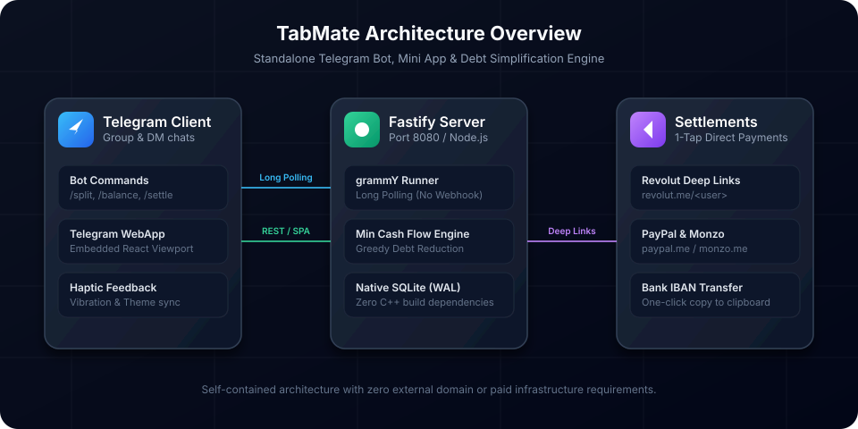

# TabMate

TabMate is an ad-free Telegram Mini App and bot for splitting group expenses and settling debts. It operates directly inside Telegram group chats or through a web browser. Debts are simplified into the fewest possible transactions using a greedy minimum cash flow algorithm, and friends can settle balances directly through Revolut, PayPal, Monzo, or IBAN transfers.



## Features

- **Telegram bot with long polling:** Runs locally without webhooks, custom domains, or SSL certificates.
- **Minimum cash flow debt engine:** Resolves circular debts and multi-person splits into minimal pairwise payments.
- **Multiple split models:** Supports equal splits, exact custom amounts, and weighted shares.
- **One-tap settlement links:** Generates direct payment links for Revolut (`revolut.me/<user>`), PayPal (`paypal.me/<user>/<amount>`), Monzo (`monzo.me/<user>/<amount>`), or bank IBAN copying.
- **Standalone web preview:** Includes a local browser mock shell so you can test all member perspectives without multiple Telegram accounts.
- **CSV export:** Exports full expense history with dates, categories, payers, and amounts.
- **Zero native build dependencies:** Built on Node.js with built-in SQLite in WAL mode.

## Quick Start

### 1. Prerequisites
- Node.js 22+ (or Node 24)
- npm 10+

### 2. Clone and install

```bash
git clone https://github.com/alexandrmotologa/tabmate.git
cd tabmate

# Install server dependencies
cd server && npm install && cd ..

# Install web dependencies
cd web && npm install && cd ..
```

### 3. Run in development mode

You can run both the frontend and backend concurrently or in separate terminals:

```bash
# Terminal 1: Backend service (port 8080)
npm run dev:server

# Terminal 2: React Mini App (port 5173 with proxy to backend)
npm run dev:web
```

Open `http://localhost:5173` in your browser. The app loads the pre-seeded "Summer Trip to Rome" demo group.

### 4. Run with Docker

```bash
docker compose up --build
```

Access the application at `http://localhost:8080`.

## Telegram Bot Setup

To connect TabMate to a live Telegram bot:

1. Open Telegram and search for `@BotFather`.
2. Send `/newbot` and follow the prompts to choose a name and username.
3. Copy the HTTP API token provided by BotFather.
4. Set the token in your `.env` file:
   ```env
   TELEGRAM_BOT_TOKEN=123456789:ABCdefGHIjklMNOpqrSTUvwxYZ
   WEBAPP_URL=https://your-public-url.com
   ```
5. In `@BotFather`, send `/setinline` and select your bot to enable inline actions.
6. Add the bot to any group chat and type `/split 45 Dinner` or `/balance`.

For detailed instructions on menu buttons and privacy settings, see [docs/TELEGRAM_SETUP.md](docs/TELEGRAM_SETUP.md).

## Bot Commands

| Command | Chat Type | Description |
| :--- | :--- | :--- |
| `/start` | Private / Group | Displays welcome screen, personal balances, and Mini App launcher |
| `/split <amount> <title>` | Group | Registers an expense and replies with an interactive split button |
| `/balance` | Group | Prints a text summary of who owes whom in the group |
| `/settle` | Group | Provides payment links to settle outstanding debts |
| `/demo` | Private | Opens the pre-seeded Rome vacation demo group |

## Project Structure

```
tabmate/
├── .github/workflows/ci.yml # GitHub Actions pipeline
├── docs/                    # Technical documentation
│   ├── ARCHITECTURE.md      # System design and data flow
│   ├── API.md               # REST API documentation
│   ├── TELEGRAM_SETUP.md    # BotFather configuration guide
│   └── ALGORITHM.md         # Debt simplification algorithm analysis
├── server/                  # Fastify backend & Telegram bot
│   ├── src/
│   │   ├── bot/             # grammY bot commands and handlers
│   │   ├── db/              # SQLite database connection and queries
│   │   ├── engine/          # Minimum cash flow debt simplifier & seeder
│   │   ├── routes/          # REST API endpoints
│   │   ├── security/        # Telegram initData validator
│   │   └── index.ts         # Fastify server entrypoint
│   ├── package.json
│   └── tsconfig.json
├── web/                     # React 18 + Vite Telegram Mini App
│   ├── src/
│   │   ├── components/      # UI components (BalanceCard, ExpenseList, Modals)
│   │   ├── hooks/           # useTelegram and useGroupData hooks
│   │   ├── App.tsx          # Main application container
│   │   └── main.tsx
│   ├── package.json
│   └── vite.config.ts
├── docker-compose.yml
├── Dockerfile
└── package.json             # Monorepo scripts
```

## Running Tests

Run the backend unit test suite:

```bash
npm test
```

The tests verify that circular debts resolve to zero, multi-party debt chains collapse into direct debtor-to-creditor payments, and payment links format correctly.

## Documentation

- [Architecture Guide](docs/ARCHITECTURE.md)
- [REST API Reference](docs/API.md)
- [Debt Simplification Algorithm](docs/ALGORITHM.md)
- [Telegram Bot Setup](docs/TELEGRAM_SETUP.md)

## License

MIT (c) 2026 Alexandr Motologa
